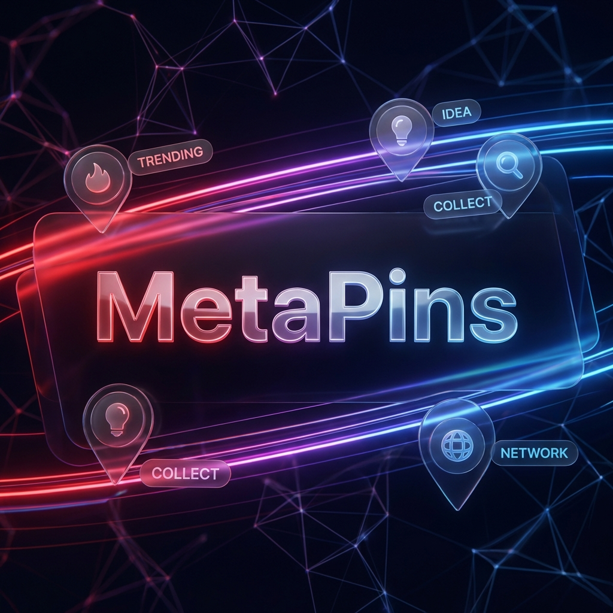

# <p align="center">✨ MetaPins</p>

<p align="center">
  
</p>

<p align="center">
  <strong>A Smart Visual Discovery Engine</strong><br>
  <em>Personalized discovery powered by data-driven intelligence.</em>
</p>

<p align="center">
  
  
  
</p>

---

## 🚀 What is MetaPins?

MetaPins is a visually stunning platform for discovering and organizing ideas. While it looks like a gallery, it thinks like a search engine. Under the hood, it uses **smart data analytics** to learn what you love and show you more of it.

---

## 🧠 Smart Data Magic

We focus on the "Big Data" side to make your experience feel personal. Here is how the brain of MetaPins works:

### 1. The "Similarity" Engine 🔍
Ever wondered why you see perfect matches? We don't just look at tags; we analyze:
- **Rare Tag Matching**: If you like something unique, we prioritize that over generic categories.
- **Visual Harmony**: The system analyzes colors to keep your feed aesthetically consistent.

### 2. Your Digital Profile 👤
Every time you interact, MetaPins gets smarter:
- It tracks your favorite categories in real-time.
- It re-ranks your feed so your top interests always appear first.

### 3. Community Trends 📈
We use "Big Data" metrics to filter the best content:
- **Quality Scoring**: High-engagement pins (likes/saves) are prioritized automatically.
- **Freshness Control**: The system balances new content with popular favorites.

---

## � Key Features

- **Personalized Feed**: A home page that is unique to you.
- **Smart Boards**: Organize your pins into beautiful, functional collections.
- **Visual Search**: Click a pin to find its "siblings" instantly.
- **Seamless Upload**: Share your own inspiration with the world.

---

## 🛠️ Quick Start

### 1. Clone & Install
```bash
git clone https://github.com/AfsheenMahmood/MetaPins.git
cd MetaPins
```

### 2. Run Mid-Flight
**Frontend:** `cd frontend && npm install && npm run dev`  
**Backend:** `cd backend && npm install && npm start`

---

## 🎨 Clean Aesthetics
- **Modern UI**: Smooth corners and glassmorphism.
- **Premium Fonts**: Clean, readable typography.
- **Lightning Fast**: Optimized for speed and discovery.

---

